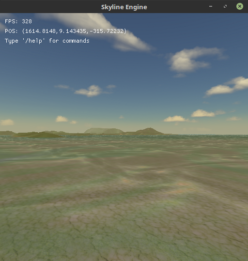

# SkylineEngine
Unity inspired game engine written in C#



# Dependencies
- https://www.nuget.org/packages/OpenTK/4.0.0
- https://www.nuget.org/packages/AssimpNet/4.1.0
- https://www.nuget.org/packages/BulletSharp.NetCore/
- https://github.com/libsdl-org/SDL (build from source or install through package manager)
- https://github.com/japajoe/imgui (build from source)

# Example

```csharp
using SkylineEngine;

namespace SkylineEngineApplication
{
    class Program
    {
        private static Application application;
        private static GameObject gameObject;

        static void Main(string[] args)
        {
            application = new Application("Skyline Engine", 512, 512, 3, 3, false);
            application.created += OnCreated;
            application.Run();            
        }

        static void OnCreated()
        {
            gameObject = new GameObject();
            gameObject.AddComponent<GameManager>();
        }
    }

    public class GameManager : MonoBehaviour
    {
        private Camera camera;
        private GameObject cube;
        private GameObject terrainObject;
        private GameObject waterObject;
        private Terrain terrain;

        void Start()
        {
            SetupCamera();
            SetupLight();
            LoadSkybox();
            LoadTerrain();
            LoadWater();

            cube = GameObject.CreatePrimitive(PrimitiveType.Cube);
            cube.transform.position = Vector3.zero;
        }

        void SetupCamera()
        {
            camera = Camera.main;            
            camera.farClipPlane = 10000.0f;
            camera.transform.position = new Vector3(0, 1, 5);

            var firstPerson = camera.gameObject.AddComponent<FirstPersonController>();
            firstPerson.speed *= 5;
            firstPerson.zoomSpeed *= 2;
        }

        void SetupLight()
        {
            Light.main.strength = 1.0f;
            Light.main.transform.position = new Vector3(0, 1000, -500);
            Light.main.transform.rotation = new Quaternion(-0.26127627f,-0.00029115385f,0.26208368f,-0.9291085f);
        }

        //Textures are not included in this project
        void LoadSkybox()
        {
            string left = "res/Textures/Skyboxes/Sahara/left.tga";
            string right = "res/Textures/Skyboxes/Sahara/right.tga";
            string top = "res/Textures/Skyboxes/Sahara/top.tga";
            string bottom = "res/Textures/Skyboxes/Sahara/bottom.tga";
            string front = "res/Textures/Skyboxes/Sahara/front.tga";
            string back = "res/Textures/Skyboxes/Sahara/back.tga";

            SkyboxFaces faces = new SkyboxFaces(left, right, top, bottom, front, back);
            RenderPipeline.LoadSkybox(faces);
        }

        //Textures are not included in this project
        void LoadTerrain()
        {
            terrainObject = new GameObject();
            terrain = terrainObject.AddComponent<Terrain>();
            terrain.splatMap = Resources.Load<Texture>("res/Textures/SplatMap.jpg");
            terrain.texture1 = Resources.Load<Texture>("res/Textures/Grass1.jpg");
            terrain.texture2 = Resources.Load<Texture>("res/Textures/Grass2.jpg");
            terrain.texture3 = Resources.Load<Texture>("res/Textures/Dirt.jpg");
            terrain.texture4 = Resources.Load<Texture>("res/Textures/GrassFlowers.jpg");
        }

        void LoadWater()
        {
            waterObject = new GameObject();
            waterObject.AddComponent<Water>();
            waterObject.transform.position += new Vector3(0, 2, 0);
        }

        //Only call ImGui/GUI functions from void OnGUI
        void OnGUI()
        {
            GUI.Label(new Rect(5,5,200,20), "Skyline Engine");
        }
    }
}
```
